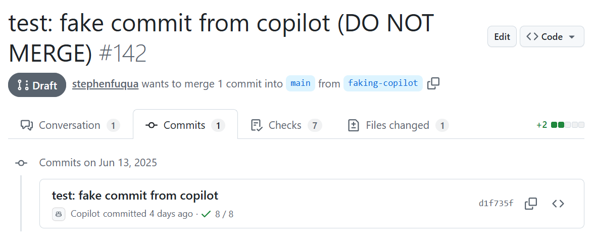

# GitHub CoPilot and Signed Commits

GitHub CoPilot [Coding
Agent](https://docs.github.com/en/copilot/using-github-copilot/coding-agent) is
an impressive and powerful tool for "autonomously" completing development tasks
running in GitHub's environment. Like any tool, there is a learning curve ahead
before any of us become truly high functioning, beginning with the statement of
a well crafted prompt. But I have a significant concern: lack of commit signing.

Git commit signing uses public/private key encryption to validate the identity
of the individual who created any given commit. Without signing, it is trivial
to spoof the identity of the committer. GitHub's [Well-Architectured
Framework](https://wellarchitected.github.com/library/governance/recommendations/governance-policies-best-practices)
reflects on this: "Initiate and impose commit signing whenever possible. This
will deter malicious actors from creating a commit with malicious code and help
prevent a possible supply chain attack."

Take a look at [this pull
request](https://github.com/Ed-Fi-Alliance-OSS/Ed-Fi-Actions/pull/142/commits) I
created.

Looks like Copilot created that commit, doesn't it? But I was the originator.
Note the lack of a [green "VERIFIED"
badge](https://docs.github.com/en/authentication/managing-commit-signature-verification/about-commit-signature-verification).
After using Coding Agent on an issue in this repository, I fetched the
repository, looked closely at the committer in the ref log, and used that info
to spoof the author of my new commit.

Currently we require signed commits in all of my organizations' repositories.
Consequently I had to disable that before I could accept the Coding Agent pull
request. There is no way (that I can find) of configuring Coding Agent to sign
commits - even though other bots, such as Dependabot, are able to do this. And
there is no way to set a branch rule that lets Copilot bypass the commit signing
requirement. This raises the question:

⚠️ Is it time to relax the signed commit requirement?

What do others do? Microsoft, for example, [does not require signed
commits](https://github.com/dotnet/aspire/pull/9816/commits). The final merge
into the `main` branch _is_ signed by GitHub, so that's something. If this is good enough for Microsoft, is it good enough for us?

Commit signing is ultimately about trust: do you trust the committer, and by extension, the committed code? This trust is (or should be) backed up
with quality code reviews, static application security testing (SAST), and other
defensive measures, regardless of who created the commit.

Is the productivity benefit of Coding Agent worth the tradeoff on commit
signing? We have solid engineering practices, [SLSA level 2](https://slsa.dev/)
compliance, and receive high marks from security auditors for the strength of
our build pipeline. Commit signing is the least of our security measures.

Coding Agent can be a valuable and productive tool for resolving well documented
issues quickly, while allowing my team to remain more focused on feature
development (with or without Coding Agent). On balance, lifting the enforcement
of code signing to allow use of Code Agent seems worth the tradeoff.
