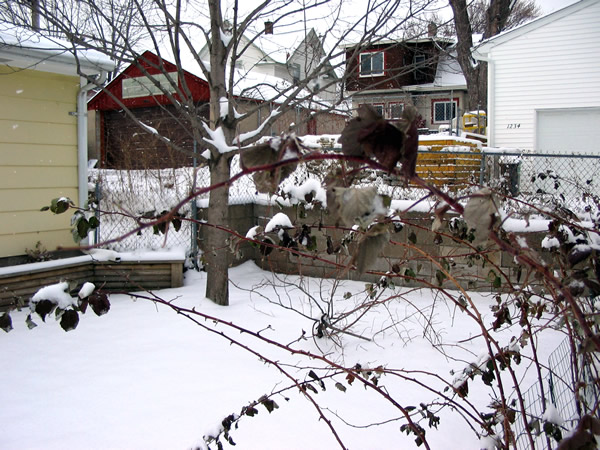

Completed shortly before his death in 1948, University of Wisconsin forestry professor [Aldo Leopold](https://en.wikipedia.org/wiki/Aldo_Leopold) grants his readers the supreme privilege of seeing nature through the original ecologist's eyes. Leopold was probably not the first to use the term "ecologist", nor the first to be be so branded; surely he was the first to deserve it. Though it may appear a quaint historical piece at first glance, its message is no less potent and relevant in the 21st century: nature, _the land_, deserves full respect and love without regard to traditional economics. Without this, effort at conservation will be a vain half-measure at best.

Snowfall in the backyard today

<!-- truncate -->

_Sand County Almanac_ is a series of short pieces, organized in
three primary units: A Sand County Almanac, Sketches Here and There, and The
Upshot. Each is filled with a beautiful prose showing an easy command of the
English language and yet also displaying enough humility to remain accessible
to all. Along with scientific precision Leopold brings evocative imagery and
an emotion at times ironic, but never overly so.

The Almanac teaches us how to really see nature — how to understand
a thing for what it is instead of what it is not. Thus the Leopold-educated,
confronted with a marshy backwater, is no longer prone to see it as a lost
opportunity for development. Rather, she will encounter a unique habitat,
developed over geologic time into a home for beautiful pasque flowers,
graceful cranes, and playful muskrats. Through a web of consumption —
passing energy up through the soil to the plants, herbivores, carnivores, and
back to the soil — the marsh sustains itself with only slow changes
over time. Without the right mix of players, the biota is liable to collapse
to a less sustainable, less organized, and less diverse state; in other
words, it will devolve into a field of corn.

In the Sketches, we get a portrait of Leopold's development as a young
man and as a forester. Reading the Sketches, one feels a great sense of loss
for all that humanity has done to its environs, for all that humanity
unintentionally — and unfeelingly— has destroyed. And yet it is
clear that he continues to respect the best elements of humanity:

> To love what _was_ is a new thing under the sun, unknown to most
> people and to all pigeons. To see America as history, to conceive of
> destiny as a becoming, to smell a hickory tree through the still lapse of
> ages — all these things are possible for us, and to achieve them
> takes only the free sky, and the will to ply our wings. In these things,
> and not in Mr. Bush's bombs and Mr. DuPont's nylons, lies objective
> evidence of our superiority over the beasts.

We find that he is no Luddite. He does not shun civilization or the
amenities of life. Its just that he believes in moderation, and convincingly
shows that what most of us take for moderation remains overindulgence. What I
think he laments most in mankind is the lack of a sense of connection to the land.

This theme of connection is more thoroughly explored in the final unit,
The Upshot. These four essays take both a more philosophic and political bent
(though by no means partisan). The crowning jewel of the book is "The
Land Ethic." He wishes us to see the land not as merely dirt, trees and
water, but as a complex regenerative system that is beautiful and deserving
of respect in its own right. My guess is that this is the most influential
paragraph of the entire work:

> The 'key-log' which must be moved to release the evolutionary
> process for an ethic is simply this: quit thinking about decent land-use as
> solely an economic problem. Examine each question in terms of what is
> ethically and esthetically right, as well as what is economically
> expedient. A thing is right when it tends to preserve the integrity,
> stability, and beauty of the biotic community. It is wrong when it tends
> otherwise.

Incidentally, within "The Land Ethic" one can find the seeds of
Gaia theory, Jared Diamond's _Guns, Germs, and Steel_ theories,
and a clear understanding of the systems and complexity theories that were
only beginning to emerge within the scientific community.

The _Almanac_ is a masterwork. It breathes the rarefied air of
non-fiction elevated to the point of literature. Any education system that
wishes to impart to its students an ability to know and understand nature
(the goal of science) should require reading at least a selection. Any
citizen who wishes to play a positive role in the future development of her
city, region, nation ought to partake of Leopold's genius. This is a work
that will stand the test of time. If one day a child, hearing of its fame,
should read the _Almanac_ and wonder at its hallowed status in light
of what he perceives as commonplace observations, then shall we know that the
Land Ethic has truly taken hold.

_For a sample of Leopold's writing, I recommend [Thinking Like a
Mountain](https://archive.org/details/ThinkingLikeAMountain), the first piece I
ever read from him. From the Sketches, it expresses both a magnificent sense of
the order in nature, along with Leopold's wistfulness about mankind's present
role in the greater ecosystem.
